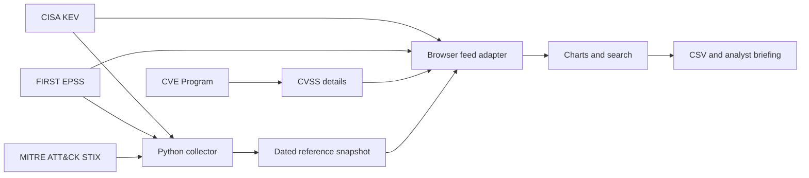

# SignalDesk

A public threat-intelligence workspace for exploring exploited vulnerabilities and documented adversary behaviour.

**[Open the dashboard](https://bzainab.github.io/signaldesk-threat-intelligence/)** · [Python analysis toolkit](https://github.com/bzainab/cti-analysis-toolkit)

## A two-minute walkthrough

1. Search a CVE, product or vendor in the intelligence explorer.
2. Click a month or vendor bar to narrow the results; combine it with a triage filter.
3. Open a CVE to inspect its source description, ransomware status, dated EPSS score and live CVSS enrichment.
4. Follow the CVE Program, NVD or CISA links for primary-source research.
5. Export the filtered CSV or a short briefing with assumptions and next steps.
6. Open the adversary library, search FIN7 or a technique, and inspect documented group-to-technique relationships.

## Collection and freshness

The collector retrieves [CISA KEV](https://github.com/cisagov/kev-data), [FIRST EPSS](https://www.first.org/epss/api) and [MITRE ATT&CK](https://github.com/mitre-attack/attack-stix-data). The initial dated snapshot contains 1,716 CVEs, 240 EPSS enrichments and 176 groups. Counts change as sources evolve.

The browser retrieves CISA and EPSS directly from their public APIs when opened or refreshed. CVSS is requested from the CVE Program when a record is opened. If live collection fails, the dashboard explicitly labels the dated reference snapshot. Missing enrichment stays unknown.

The GitHub Pages workflow collects a fresh reference dataset on pushes to `master` and daily at 06:23 UTC, then tests, builds and publishes the dashboard. Scheduled jobs can be delayed or disabled by GitHub after repository inactivity. A failed collection leaves the previous deployment intact. ATT&CK uses this collected snapshot so visitors do not download the entire STIX dataset.

## Local development

Use Node 22.18+ (Node 24 in CI), Python 3.12+ and pnpm 11. React, TypeScript, Vite and Tailwind power a static application, with no server credentials or paid services required.

```sh
pnpm install --frozen-lockfile
pnpm dev
pnpm test
pnpm build
pnpm preview
```

Open the URL printed by the development server, including `/signaldesk-threat-intelligence/`. To refresh the reference data:

```sh
python scripts/collect.py --output public/data/intelligence.json
```

## Architecture



Public upstream hosts are fixed in code; input cannot choose a fetch destination. CVE identifiers are validated. Source text is rendered as text, not raw HTML. CSV cells neutralise spreadsheet formula prefixes. There are no API keys, private assets, sign-in requirements or write operations in the dashboard.

## Interpretation

Elevated means known ransomware use or EPSS ≥ 50%; High means EPSS ≥ 10%; Review covers remaining records, including missing scores. These are transparent portfolio triage rules, **not CVSS severity**. Every KEV entry still requires review. EPSS is requested for the latest 240 records; a missing value is not a zero probability.

KEV confirms exploitation in the wild, not exposure or compromise at a particular company. Asset criticality, affected versions and compensating controls must be checked separately. CISA directive deadlines are source context rather than a private organisation's deadlines. ATT&CK relationships are historical source assertions; the application does not infer attribution between a group and a CVE.

## Validation and boundaries

Tests cover triage boundaries, missing scores, compound search, CSV injection handling, source failure fallback, EPSS association and CVSS extraction. The production build also checks TypeScript. The UI uses accessible table, select, tabs and dialog primitives, visible keyboard focus and responsive layouts.

Public API availability and cross-origin access affect live refresh. The dated snapshot remains usable during source failures. There is no continuous alerting, enterprise asset discovery, commercial-feed integration or persistent case management.

## Deployment

The source branch is `master`. Enable GitHub Pages with **GitHub Actions** as the publishing source. The included workflow publishes `dist` to the repository's Pages address. For a different repository name, change `base` in `vite.config.ts` and the links above.

Third-party datasets retain their source licences and attribution. See [CISA KEV](https://github.com/cisagov/kev-data), [FIRST data terms](https://www.first.org/epss/data) and [MITRE ATT&CK terms](https://attack.mitre.org/resources/terms-of-use/).
